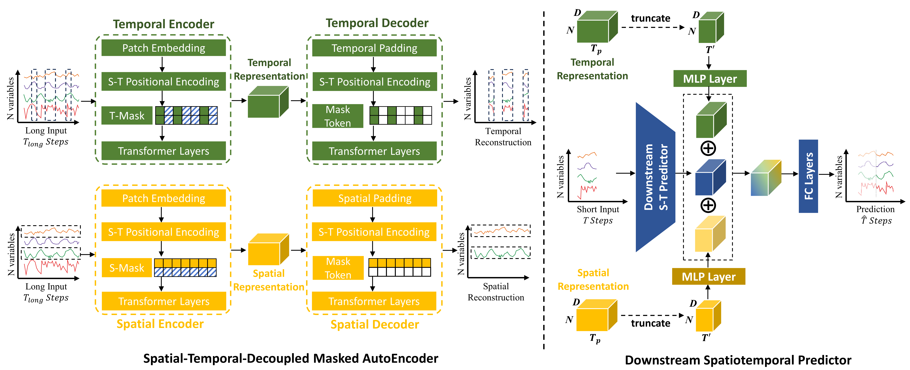
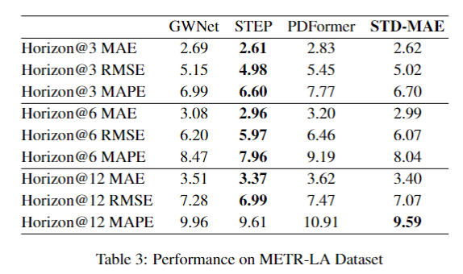
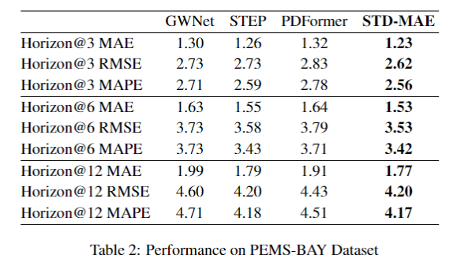
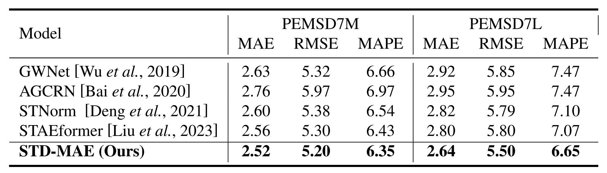
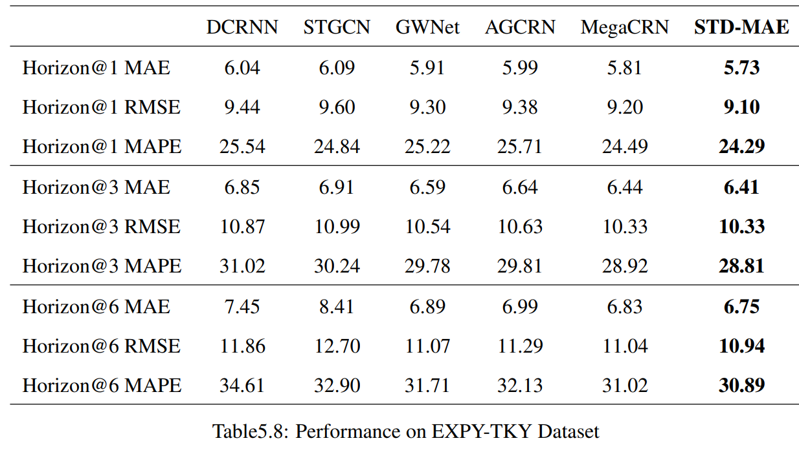

# <div align="center">[IJCAI-24] Spatial-Temporal-Decoupled Masked Pre-training for Spatiotemporal Forecasting </div>




## Google Scholar
Due to the change in title, you can find our article by searching **STD-MAE** directly.

## Preprint Link (All six datasets [PEMS03, 04, 07, 08, PEMS-BAY, and METR-LA] are included. You can also check the performace of PEMSD7M, PEMSD7L, and EXPY-TKY datasets in this repo.)
[](https://arxiv.org/abs/2312.00516)
[](https://www.ijcai.org/proceedings/2024/0442.pdf)


## Citation
> [!NOTE] 
> If you find this repository useful for your research, please cite our work :)
> 
> ArXiv Version
> ```LaTeX
> @article{gao2023spatio,
>   title={Spatio-Temporal-Decoupled Masked Pre-training for Traffic Forecasting},
>   author={Gao, Haotian and Jiang, Renhe and Dong, Zheng and Deng, Jinliang and Song, Xuan},
>   journal={arXiv preprint arXiv:2312.00516},
>   year={2023}
> }
>  ```
> IJCAI-2024 Version
> ```LaTeX
>@inproceedings{ijcai2024p0442,
>  title     = {Spatial-Temporal-Decoupled Masked Pre-training for Spatiotemporal Forecasting},
>  author    = {Gao, Haotian and Jiang, Renhe and Dong, Zheng and Deng, Jinliang and Ma, Yuxin and Song, Xuan},
>  booktitle = {Proceedings of the Thirty-Third International Joint Conference on
>               Artificial Intelligence, {IJCAI-24}},
>  publisher = {International Joint Conferences on Artificial Intelligence Organization},
>  editor    = {Kate Larson},
>  pages     = {3998--4006},
>  year      = {2024},
>  month     = {8},
>  note      = {Main Track},
>  doi       = {10.24963/ijcai.2024/442},
>  url       = {https://doi.org/10.24963/ijcai.2024/442},
>}
>  ```
## Performance on Spatiotemporal Forecasting Benchmarks
* **Please note you can get a much better performance on PEMS07 dataset using pre-training length of 2016. But it is a time-cosuming operation.**

[](https://paperswithcode.com/sota/traffic-prediction-on-pemsd3?p=spatio-temporal-decoupled-masked-pre-training)
[](https://paperswithcode.com/sota/traffic-prediction-on-pems04?p=spatio-temporal-decoupled-masked-pre-training)
[](https://paperswithcode.com/sota/traffic-prediction-on-pems07?p=spatio-temporal-decoupled-masked-pre-training)
[](https://paperswithcode.com/sota/traffic-prediction-on-pemsd8?p=spatio-temporal-decoupled-masked-pre-training)
[](https://paperswithcode.com/sota/traffic-prediction-on-pems-bay?p=spatio-temporal-decoupled-masked-pre-training)
[](https://paperswithcode.com/sota/traffic-prediction-on-metr-la?p=spatio-temporal-decoupled-masked-pre-training)
[](https://paperswithcode.com/sota/traffic-prediction-on-pemsd7-m?p=spatio-temporal-decoupled-masked-pre-training)
[](https://paperswithcode.com/sota/traffic-prediction-on-pemsd7-l?p=spatio-temporal-decoupled-masked-pre-training)
[](https://paperswithcode.com/sota/traffic-prediction-on-expy-tky-1?p=spatio-temporal-decoupled-masked-pre-training)


METR-LA             |  PEMS-BAY
:-------------------------:|:-------------------------:
  |  

PEMSD7M&L           
:-------------------------:
  

EXPY-TKY           
:-------------------------:
  

You can check more baseline results at [Torch-MTS](https://github.com/XDZhelheim/Torch-MTS).

## 💿 Dependencies

### OS

Linux systems (*e.g.* Ubuntu and CentOS). 

### Python

The code is built based on Python 3.9, PyTorch 1.13.0, and [EasyTorch](https://github.com/cnstark/easytorch).
You can install PyTorch following the instruction in [PyTorch](https://pytorch.org/get-started/locally/). 

[Miniconda](https://docs.conda.io/en/latest/miniconda.html) or [Anaconda](https://www.anaconda.com/) are recommended to create a virtual python environment.

We implement our code based on [BasicTS](https://github.com/zezhishao/BasicTS/tree/master).

### Other Dependencies

```bash
pip install -r requirements.txt
```


## Getting started
STD-MAE has now been integrated into [BasicTS](https://github.com/GestaltCogTeam/BasicTS/tree/master/baselines/STDMAE). You can also check many baselines there.

### Download Data

You can download data from [BasicTS](https://github.com/zezhishao/BasicTS/tree/master) and unzip it.

### Preparing Data


- **Pre-process Data**

You can pre-process all datasets by


    cd /path/to/your/project
    bash scripts/data_preparation/all.sh

Then the `dataset` directory will look like this:

```text
datasets
   ├─PEMS03
   ├─PEMS04
   ├─PEMS07
   ├─PEMS08
   ├─raw_data
   |    ├─PEMS03
   |    ├─PEMS04
   |    ├─PEMS07
   |    ├─PEMS08
   ├─README.md
```

### Pre-training on S-MAE and T-MAE

```
cd /path/yourproject
```

Then run the folloing command to run in Linux screen.

```
screen -d -m python stdmae/run.py --cfg='stdmae/TMAE_PEMS03.py' --gpus='0' 

screen -d -m python stdmae/run.py --cfg='stdmae/TMAE_PEMS04.py' --gpus='0'

screen -d -m python stdmae/run.py --cfg='stdmae/TMAE_PEMS07.py' --gpus='0' 

screen -d -m python stdmae/run.py --cfg='stdmae/TMAE_PEMS08.py' --gpus='0'

screen -d -m python stdmae/run.py --cfg='stdmae/SMAE_PEMS03.py' --gpus='0' 

screen -d -m python stdmae/run.py --cfg='stdmae/SMAE_PEMS04.py' --gpus='0'

screen -d -m python stdmae/run.py --cfg='stdmae/SMAE_PEMS07.py' --gpus='0' 

screen -d -m python stdmae/run.py --cfg='stdmae/SMAE_PEMS08.py' --gpus='0'
```


### Downstream Predictor

After pre-training , copy your pre-trained best checkpoint to `mask_save/`.
For example:


```bash
cp checkpoints/TMAE_200/064b0e96c042028c0ec44856f9511e4c/TMAE_best_val_MAE.pt mask_save/TMAE_PEMS04_864.pt
cp checkpoints/SMAE_200/50cd1e77146b15f9071b638c04568779/SMAE_best_val_MAE.pt mask_save/SMAE_PEMS04_864.pt
```

Then run the predictor as :

```
screen -d -m python stdmae/run.py --cfg='stdmae/STDMAE_PEMS04.py' --gpus='0' 

screen -d -m python stdmae/run.py --cfg='stdmae/STDMAE_PEMS03.py' --gpus='0' 

screen -d -m python stdmae/run.py --cfg='stdmae/STDMAE_PEMS08.py' --gpus='0'

screen -d -m python stdmae/run.py --cfg='stdmae/STDMAE_PEMS07.py' --gpus='0' 
```


* To find the best result in logs, you can search `best_` in the log files.

### IJCAI Poster

