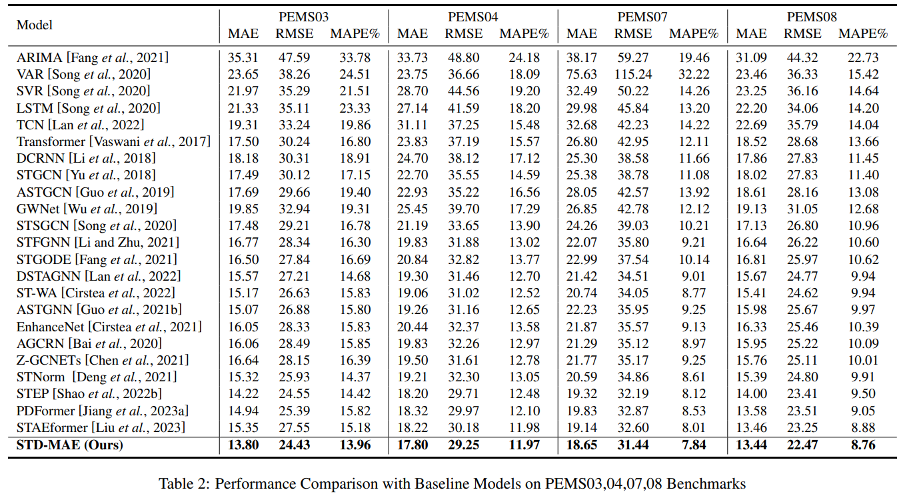

* We implement our code based on [STEP](https://github.com/zezhishao/STEP/tree/github ) and  [BasicTS](https://github.com/zezhishao/BasicTS/tree/master).

## 💿 Dependencies

### OS

Linux systems (*e.g.* Ubuntu and CentOS). 

### Python

The code is built based on Python 3.9, PyTorch 1.13.0, and [EasyTorch](https://github.com/cnstark/easytorch).
You can install PyTorch following the instruction in [PyTorch](https://pytorch.org/get-started/locally/). 

[Miniconda](https://docs.conda.io/en/latest/miniconda.html) or [Anaconda](https://www.anaconda.com/) are recommended to create a virtual python environment.

### Other Dependencies

```bash
pip install -r requirements.txt
```


## Getting started

### Download Data

You can download data from [BasicTS](https://github.com/zezhishao/BasicTS/tree/master) and unzip it.

### Preparing Data


- **Pre-process Data**

You can pre-process all datasets by


    cd /path/to/your/project
    bash scripts/data_preparation/all.sh

Then the `dataset` directory will look like this:

```text
datasets
   ├─PEMS03
   ├─PEMS04
   ├─PEMS07
   ├─PEMS08
   ├─raw_data
   |    ├─PEMS03
   |    ├─PEMS04
   |    ├─PEMS07
   |    ├─PEMS08
   ├─README.md
```


### Model definition

GWN model is in the directory
```
basicts\archs\arch_zoo\gwnet_arch\
```

### Run GWN

```
python examples/run.py -c examples/GWNet/GWNet_PEMS03.py --gpus '0'
python examples/run.py -c examples/GWNet/GWNet_PEMS04.py --gpus '0'
python examples/run.py -c examples/GWNet/GWNet_PEMS07.py --gpus '0'
python examples/run.py -c examples/GWNet/GWNet_PEMS08.py --gpus '0'

```

### Results

```
See the directory \checkpoints\GWNet200 to see all results
To find the best model in val, you can search "best_" in the training log file.
```

## 📉  Results table



